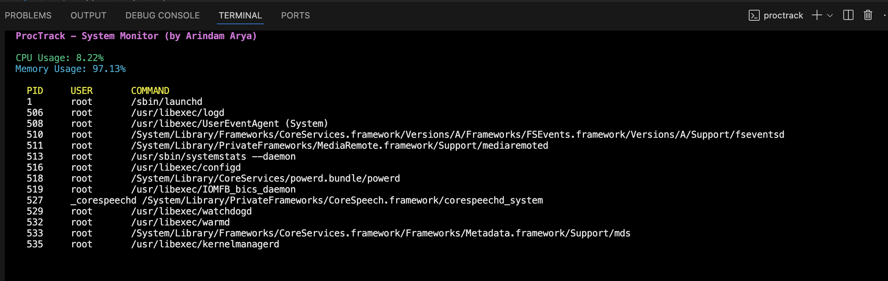

# ProcTrack

️ A real-time terminal-based system monitor built with C++ for macOS.  
Displays live CPU usage, memory usage, and a snapshot of running processes using a dynamic ncurses-based dashboard.

##  Features

- Real-time CPU & memory monitoring
- Terminal UI using `ncurses`
- Live process listing (like `top`)
- Built for macOS using `sysctl` & `ps`

##  Project Demo

Below is a live demo screenshot of `ProcTrack` running on macOS terminal with CPU, Memory, and Process info:

## ️ Tech Stack

- C++
- ncurses (terminal UI)
- macOS system calls (`sysctl`, `/proc`, `ps`)
- `make` build system

##  Folder Structure
ProcTrack/
├── include/ # Header files
├── src/ # Source files
├── Makefile # Build system
├── README.md # Project info
└── .gitignore # Ignore temp files

